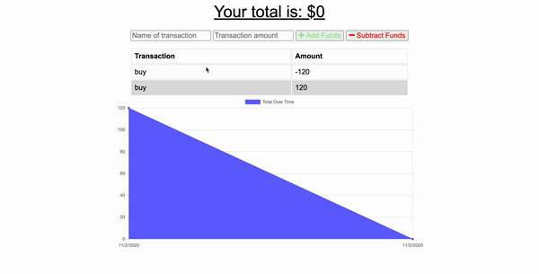
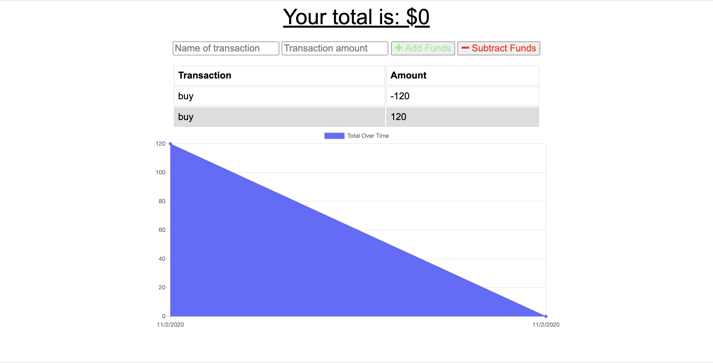

## Badges

## Description:
This application allows a user to track funds in a budget by entering transactions. It uses progressive web application technology to provide functionality while offline - transactions are able to be entered and saved and post to the database when the app returns to an online state.

## Technologies:
- Node.js
- Express
- MongoDB
- Mongoose
- Heroku
- Indexed DB
- Service Worker
- Manifest
- JSON

## Table of Contents
* [Description](#description)
* [Technologies](#topics)
* [Installation](#installation)
* [Usage](#usage)
* [Contributing](#contributing)
* [Test](#test)
* [Challenges](#challenges)
* [Questions](#questions)
* [License](#license)
* [Author](#Author)
* [Badges](#badges)

## Installation
Before installing this application on your local computer, ensure that you have Node installed. This application works in Node. You can go to the following website to download Node: <a href='https://nodejs.org/en/'>Node</a>

    1. Clone the Git repository
        $ git clone <repo>
    2. Navigate to the directory and install the dependencies
        $ npm init to create package.json package
        $ npm install express mongo morgan mongoose compression lite-server
    3.  To run it locally, make sure that the MongoDB server is running on your machine.

## Usage
Once all dependencies have been installed - run node server.js to launch the application. Go to localhost + the port number.

## Contributors
This application is open to anyone who wants to contribute or enhance the application. If you would like to contribute please reach out to me on Github or email.

## Test
There are no automatic test designed for this application. I ran manual test to make sure everything was working the way it should.
    - input transaction name, amount and clicked add to add the transaction to the list.
    - input transaction name, amount and clicked subtract to subtract the amount from the transaction list.
    - the transactions were displayed in the chart area

If you would like to design an automatic test for this application feel free to reach me on GitHub or Email

## Challenges
The only challenge I experience with this application was creating the offline capabilities. This was something I have never done before or used before. I used the videos from class and did research online to be able to accomplished the offline capabilities. I was able to successfully use manifest.json and service-worker and db.js to cache the information for offline use.

## Questions
If you have questions about this repository? Please contact me at [kamara.moses@yahoo.com](mailto:kamara.moses@yahoo.com). View more of my work in GitHub at [kamara-moses](https://github.com/kamara-moses).

## License
This repository is licensed under the MIT license.

Copyright (c) [2020] [Moses Kamara]

Permission is hereby granted, free of charge, to any person obtaining a copy of this software and associated documentation files (the 'Software'), to deal in the Software without restriction, including without limitation the rights to use, copy, modify, merge, publish, distribute, sublicense, and/or sell copies of the Software, and to permit persons to whom the Software is furnished to do so, subject to the following conditions:

The above copyright notice and this permission notice shall be included in all copies or substantial portions of the Software.

THE SOFTWARE IS PROVIDED 'AS IS', WITHOUT WARRANTY OF ANY KIND, EXPRESS OR IMPLIED, INCLUDING BUT NOT LIMITED TO THE WARRANTIES OF MERCHANTABILITY, FITNESS FOR A PARTICULAR PURPOSE AND NONINFRINGEMENT. IN NO EVENT SHALL THE AUTHORS OR COPYRIGHT HOLDERS BE LIABLE FOR ANY CLAIM, DAMAGES OR OTHER LIABILITY, WHETHER IN AN ACTION OF CONTRACT, TORT OR OTHERWISE, ARISING FROM, OUT OF OR IN CONNECTION WITH THE SOFTWARE OR THE USE OR OTHER DEALINGS IN THE SOFTWARE.

## Author 

